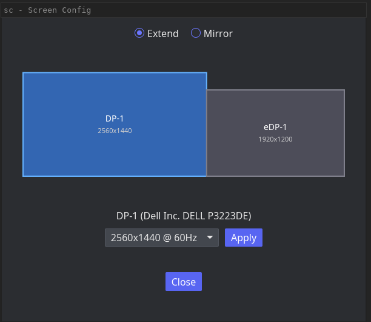

# sc - Sway Screen Configuration

A simple GUI tool for managing monitor layout in [Sway](https://swaywm.org/).

## Features

- Visual monitor layout with drag-and-drop repositioning
- Live reordering while dragging (monitors swap when dragged past each other)
- Edge and alignment snapping (top, center, bottom)
- Free positioning: side-by-side, above, or below
- Resolution selection per monitor
- Extend / Mirror mode toggle
- Auto-detects monitor connect/disconnect via Sway IPC events

## Screenshot



## Building

Requires Rust 1.88+.

```sh
cargo build --release
```

The binary is at `target/release/sc`.

## Installation

```sh
cp target/release/sc ~/.local/bin/
```

To make the window float in Sway, add to `~/.config/sway/config`:

```
for_window [app_id="simple_sway_screen_config"] floating enable
```

## Usage

Launch `sc` from a terminal or application launcher. Click a monitor in the
canvas to select it, drag to reposition. Monitors swap live when dragged past
each other. On release, the monitor snaps to the nearest edge or alignment of
its neighbors.

Select a resolution from the dropdown and click Apply to send the configuration
to Sway. Mirror mode sets all outputs to position 0,0 with a common resolution.

## Dependencies

- [iced](https://iced.rs/) - GUI framework
- [swayipc](https://github.com/JayceFayne/swayipc-rs) - Sway IPC client

## License

MIT
